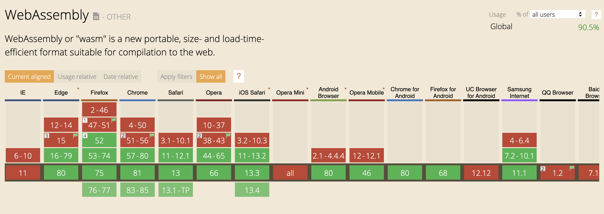
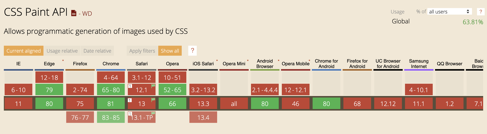
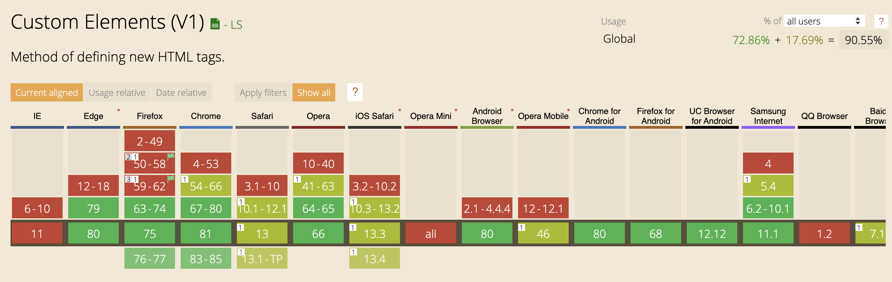

# TLDR;

There's too much tech that excites me. I've finally decided to start eliminating tech that won't provide me with a significant advantage over my current tools for developing software. This has led me to focus on three key technologies for the year; GraphQL, Python and Elixir. Read on more to find out why I chose these and why I had to get rid of cool tech like Svelte and Cypress.

# There's Too Much To Learn!

Anyone involved with web development knows how fast the ecosystem evolves. This keeps things fresh and exciting a lot of the time. However, it's starting to take a toll on me now. I see hype around a new technology every few months and it goes into my backlog of things to learn. I'm reasonably familiar with a lot of these tools but I wouldn't say I 'know' them yet. Here's what the backlog looks like at the moment:

* [Vue](https://vuejs.org/)
* [Svelte](https://svelte.dev/)
* [Angular](https://angular.io/)
* [GraphQL](https://graphql.org/)
* [Cypress](https://www.cypress.io/)
* [Web Components](https://developer.mozilla.org/en-US/docs/Web/Web_Components)
* [Web Assembly](https://webassembly.org/)
* [CSS Houdini](https://developer.mozilla.org/en-US/docs/Web/Houdini)
* [Python](https://www.python.org/)
* [Elixir](https://elixir-lang.org/)
* [Go](https://golang.org/)
* [Rust](https://www.rust-lang.org/)
* I can keep listing tech that I want to learn like [Tailwind](https://tailwindcss.com/), [Postgres](https://www.postgresql.org/), [11ty](https://www.11ty.dev/) but I'll stop listing tech for now

# How Are You Going To Learn It A**ll?**

You funny.

I am not learning all of that. At one point I thought that I was practical with my time. But as life goes on, your interests change and you tend to spend less time for coding in favour of exploring other hobbies that interest you. This doesn't mean I'm less passionate about coding, if anything I'm more passionate, which is why I want to learn all this stuff. However, there are other things that I've taken an interest in. Things like bouldering, mountain biking and creating video content are things that I really want to focus on for the next 5 years on top of developing my understanding of software.

# So What's The Plan?

I'm going to stop pursuing technologies that won't be a massive benefit to me. I'm going to be more tool-oriented. Being tool-oriented will allow me to choose a specific technology based on my needs rather than what's trending... which makes a lot of sense now that I type it out. Perhaps if I thought this way before then I wouldn't have guilt tripped myself into staying inside to learn as much as I can.

## Frontend Frameworks

So, let's start eliminating things from the list shall we? Straight away I can tell you that [Angular](https://angular.io/), [Svelte](https://svelte.dev/) and [Vue](https://vuejs.org/) can get in the bin. I still think they're awesome tools and I especially respect the high quality efforts of [Evan You](https://evanyou.me/) (Founder of Vue) and [Rich Harris](https://twitter.com/rich_harris) (Founder of Svelte).

I just don't think any of these tools offer me a significant advantage over what I currently use, [React](https://reactjs.org/). Perhaps they offer some advantages where React falls short, but they all have their own drawbacks too. **However**, Svelte really interests me, in particular the simplicity and small bundle size for Svelte apps are catching my eye. But I can learn it when it gets a bit more mature, say in 2 years time?

## Tools For Testing

[Cypress](https://www.cypress.io/) really looks awesome, but I just can't justify prioritising it as a tool. Not all companies use it within their testing stack. It seems to me that a large number of testing stacks for [React](https://reactjs.org/) applications are built with [Jest](https://jestjs.io/), [Enzyme](https://enzymejs.github.io/enzyme/) and [React Testing Library](https://testing-library.com/docs/react-testing-library/intro). I'll be using these in my final year computer science project to get familiar with these testing tools though. Currently, I'm still stuck on [Chai](https://www.chaijs.com/), [Mocha](https://mochajs.org/) and [Jasmine](https://jasmine.github.io/).

## Native Tools

Native tools like [Web Components](https://developer.mozilla.org/en-US/docs/Web/Web_Components), [Web Assembly](https://webassembly.org/) and [CSS Houdini](https://developer.mozilla.org/en-US/docs/Web/Houdini) seem powerful. Although I don't think Web Assembly will replace JavaScript in the web, I do think it'll allow for powerful programs to exist in browsers. [Figma's already doing a good job at using it](https://www.figma.com/blog/webassembly-cut-figmas-load-time-by-3x/). I really hope Web Components become 'mainstream' too, I'd rather write web apps without a framework although I'm not opposed to using a number of small libraries. But these aren't a priority for now, I don't think they'd be suitable for the type of side projects I'll be looking to make soon and they aren't even supported in every browser yet!

### Web Assembly Support

### CSS Houdini Support

### Web Component Support

## Other Programming Languages

[Go](https://golang.org/) seems awesome. I've dabbled with making my own goroutines that communicate using channels. However, the side projects I've got coming up involve web applications, embedded systems and machine learning,. Although you can use Go for your web development needs, I don't think it offers much advantage for the scale of projects I'll be attempting. I'm happy with [Node](https://nodejs.org/en/) and [Express](https://expressjs.com/) for my web development needs... for the time being. Go is definitely something I'll be looking into soon though, just not this year. [Rust](https://www.rust-lang.org/) was another option I was considering.

My motivation for trying to learn Rust was that you can use it for Web Assembly. Since I've clarified why I won't be using Web Assembly this year I will take a break from looking at Rust. In the worst case scenario that I need to write Web Assembly code, I'm quite comfortable with [C++](https://en.cppreference.com/w/) which can also be used for writing Web Assembly.

# Stop Crossing Things Off Your List Pal.

Alright, I hear ya. Granted I've eliminated a large number of items from the list but I feel like I've justified my decisions. Those technologies clearly weren't a priority. Now, onto the fun stuff, time to show you what I'll be learning this year.

## GraphQL

I developed this blogging site with [Gatsby](https://www.gatsbyjs.org/) which involves a heavy amount of [GraphQL](https://graphql.org/) querying to request data during the build stage. So i'm reasonably comfortable at writing GraphQL queries for the client side. However, I am not at all competent at writing the GraphQL layer for the server. I'm familiar with RESTful principles, however, I think the declarative syntax of GraphQL will be easier to write and read the code. For anyone that writes code, you'll know that this is a massive advantage. It's had enough time to mature over the years and so I've set aside the summer to learn it.

## Python

[Python](https://www.python.org/)'s very much the cool kid on the block but as I said, I'm not basing my decisions off of trends. I want to be more tool-oriented. I currently use Node for my web server purposes so I probably won't be using Python for that unless [Django](https://www.djangoproject.com/) or [Flask](https://flask.palletsprojects.com/en/1.1.x/quickstart/) really impress me. The main thing that's appealing to me about Python is its large ecosystem of modules that you can import into your project.

One objective I have for myself is to automate parts of my life. I reckon Python's syntax and the abundance of modules will help me to write software to automate my life faster than another language like Go. In addition to this, I want to have done some machine learning within the next 3 years. I understand that Python has a large number of machine learning modules which has led to Python [dominating the industry for machine learning](https://www.techrepublic.com/article/github-the-top-10-programming-languages-for-machine-learning/). Although I may not learn machine learning this year, I'm always preparing for the future and I'll have learnt how to build Python programs by August.

## Elixir

You may know that I'm a university student. Unfortunately, my computer science course doesn't teach functional programming. So much for being a top 100 world university. One of the reasons I have chosen [Elixir](https://elixir-lang.org/) is because I want to learn functional programming paradigms. Through research, I've picked up that functional composition is a simpler approach to managing scalable solutions in comparison to inheritance hierarchies. In addition to this, I know that pure functions allow for easier writing, reading and testing of code. All of this really excites me.

Furthermore, I know that Elixir is built upon [Erlang](https://www.erlang.org/) which has been traditionally used for fault tolerant systems that are highly concurrent such as 3G networks around the world. I have a limited understanding of concurrency but I know the fundamental theory. I believe that using functional paradigms like immutable data make it easier to handle concurrency since you don't have to mess around with read-write locks and co.

Something intriguing about Elixir is that it runs code within isolated processes which are much more lightweight and performant compared to traditional operating system processes deployed through multiple threads. Many popular apps use Elixir like Whatsapp, Discord and Pinterest. Since Elixir ensures that your process restarts once a failure is encountered, it's highly fault tolerant and commonly used to deploy distributed systems.

Honestly, I'm probably the most excited about this language just because it's a completely new paradigm. I have a feeling that I may start a consultancy in my mid-30's and I just think it's worth understanding why a functional language would be appropriate for a job. Hopefully learning Elixir will help me understand this, it should also be interesting to see whether I prefer Elixir over Node for web development. From what I've seen, many programmers that enter the functional realm choose to stay there.

# Don't Leave Yet!

I've got nothing else to add apart from leaving a link to Ben Awad's video on ["Technologies I'm Learning In 2020"](https://www.youtube.com/watch?v=Rz1woD9L45Q). It definitely got me thinking about learning what you need rather than what looks cool.
